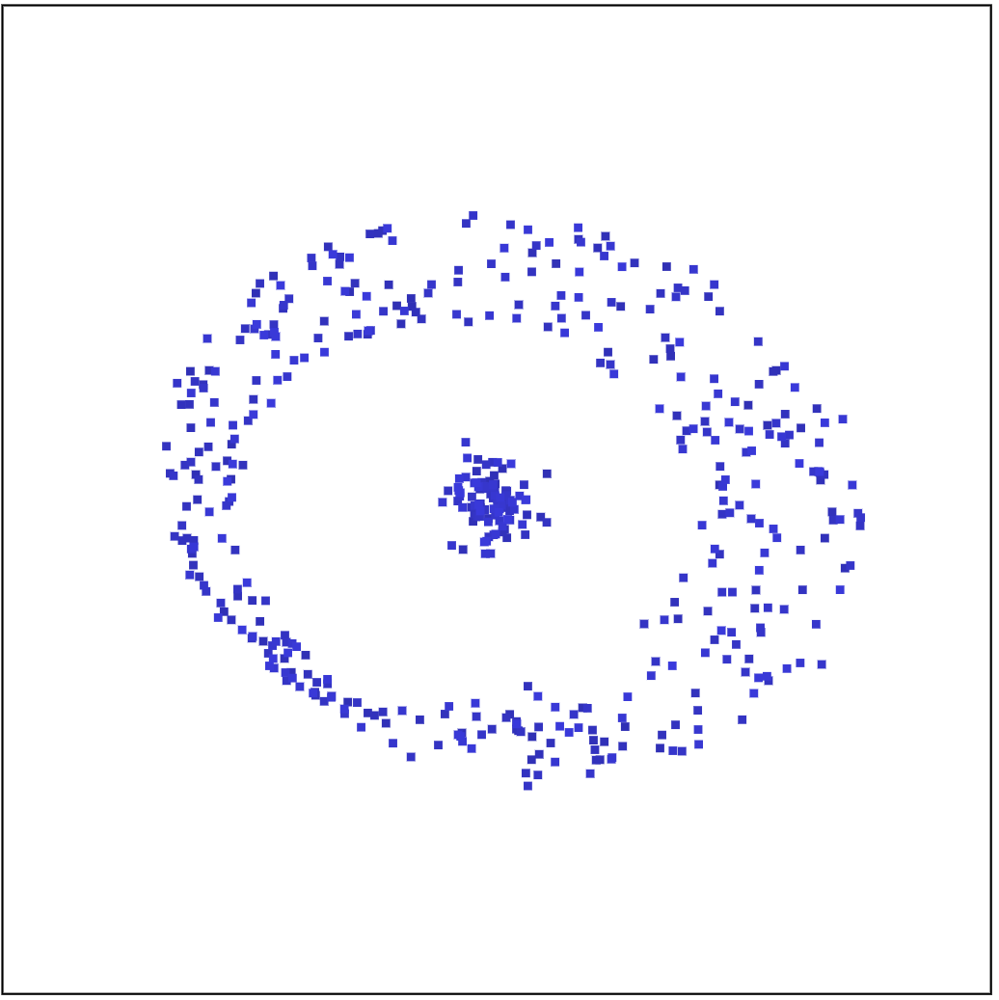

<!-- README.md is generated from README.Rmd. Please edit that file -->

# cardinalR 

The `cardinalR` package provides functionality for generating simulation
high-dimensional datasets for use in various Nonlinear dimension
reduction techniques.

## Installation

You can install the development version of `cardinalR` from
[GitHub](https://github.com/) with:

``` r
# install.packages("devtools")
devtools::install_github("JayaniLakshika/cardinalR")
```

## Example

``` r
library(cardinalR)
```

``` r
mobius_clust_data <-  mobius_clust(n = 500, num_noise = 2, min_n = -0.05, 
                                   max_n = 0.05)

head(mobius_clust_data, 5)
#>           [,1]     [,2]       [,3]         [,4]        [,5]
#> [1,]  2.384235 1.861535 -0.5586073 -0.020072385 -0.01130684
#> [2,] -2.622239 2.946592 -0.1104749  0.043530516 -0.04262104
#> [3,]  1.295260 4.018709 -0.4246547 -0.006094836  0.02994540
#> [4,] -3.966696 1.219701  0.4038015 -0.003356082 -0.03539191
#> [5,]  2.314262 2.208101 -0.2123592  0.000858585 -0.02029194
```

<table style="width:100%">
<tr>
<td align="center">

</td>
<td align="center">

</td>
<td align="center">

</td>
</tr>
</table>

You can find the high-dimensional view
[here](https://youtu.be/731aZxDifCs).

## About the name

**C**ollection of v**ar**ious high-**d**imens**i**o**nal** data
structures in **R**

## Copyright

This package is licensed under the [MIT
license](https://github.com/JayaniLakshika/cardinalR/tree/main?tab=MIT-2-ov-file).
