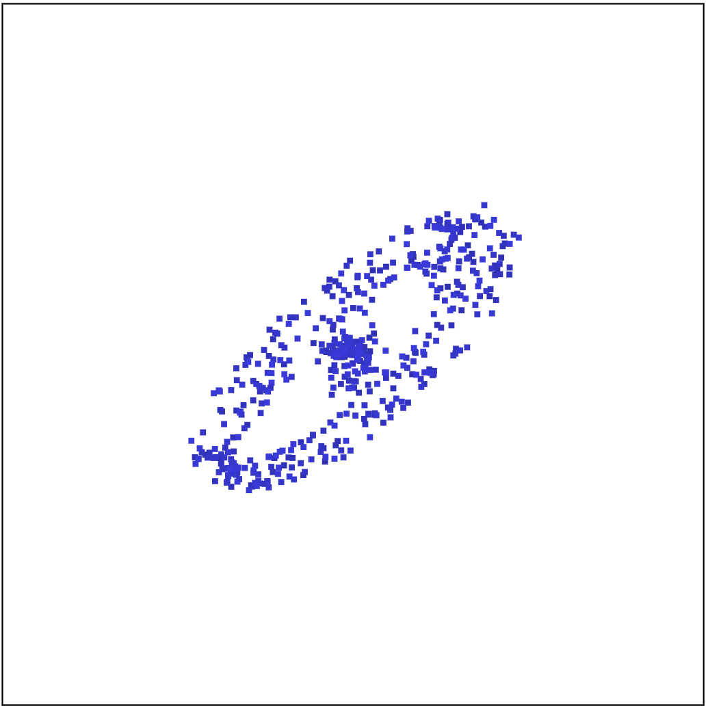

<!-- README.md is generated from README.Rmd. Please edit that file -->

# cardinalR

<!-- badges: start -->
<!-- badges: end -->

The `cardinalR` provides functionality for generating various
high-dimensional datasets.

## Installation

You can install the development version of `cardinalR` from
[GitHub](https://github.com/) with:

``` r
# install.packages("devtools")
devtools::install_github("JayaniLakshika/cardinalR")
```

## Example

``` r
library(cardinalR)
```

``` r
mobius_clust_data <-  mobius_cluster_with_noise(sample_size = 500, num_noise_dims = 2, 
                         min_noise = -0.05, max_noise = 0.05)

head(mobius_clust_data, 5)
#>            [,1]      [,2]       [,3]         [,4]         [,5]
#> [1,] -3.9718104  1.060503 -0.6123950 -0.016982711  0.030872872
#> [2,]  4.6095986  2.205923  0.5997992  0.038411169  0.044310458
#> [3,] -3.3363224 -2.291429  0.7083788 -0.009031318 -0.033687069
#> [4,] -0.7076238 -3.966934  0.4402414 -0.015493041  0.018808069
#> [5,] -2.4283439 -2.167068  1.0188565  0.017816202  0.008969055
```

<table style="width:100%">
<tr>
<td align="center">

</td>
<td align="center">

</td>
<td align="center">

</td>
</tr>
</table>

You can find the high-dimensional view
[here](https://youtu.be/731aZxDifCs).

## About the name

**C**ollection of v**ar**ious high-**d**imens**i**o**nal** data
structures in **R**

## Copyright

This package is licensed under the [MIT
license](https://github.com/JayaniLakshika/cardinalR/tree/main?tab=MIT-2-ov-file).
